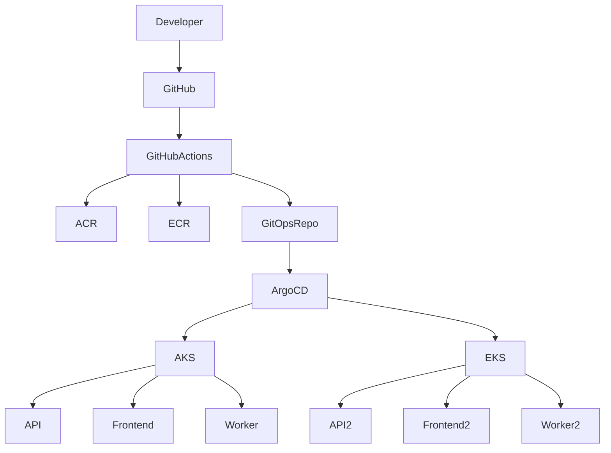

# Platform Overview



## Description

High-level view of the Multi-Cloud GitOps Platform.

The application repository builds container images while the platform repository manages deployment state through GitOps.

```
```
