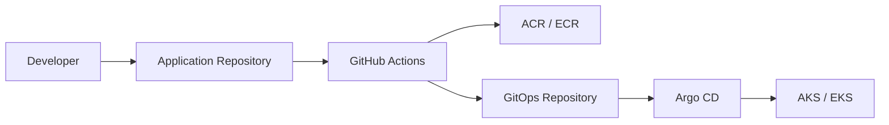

# GitOps Deployment Flow



## Description

Container images are built in the application repository.

Deployment manifests are updated in the GitOps repository.

Argo CD continuously reconciles the cluster with Git.

```
```
