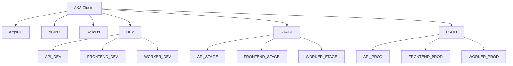

# AKS Namespace Layout



## Description

A single AKS cluster hosts all environments.

Environment isolation is achieved through Kubernetes namespaces.

Additional node capacity was required when dev and stage workloads ran simultaneously.

```
```
