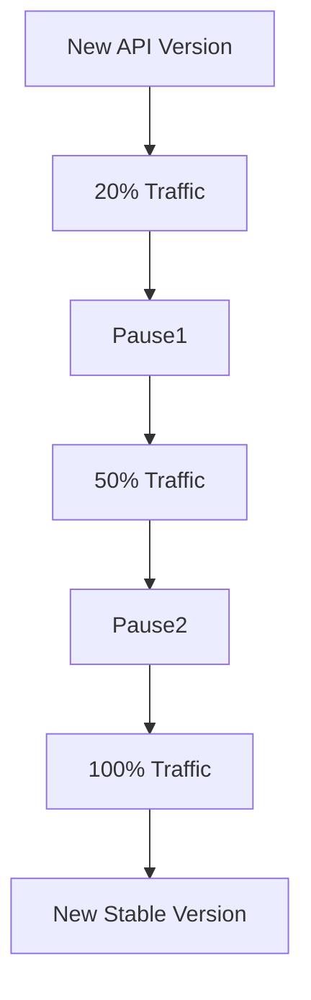

# Argo Rollouts Canary Flow



## Description

API deployments use Argo Rollouts.

Traffic is gradually shifted:

20% → 50% → 100%

The rollout is integrated with the NGINX Ingress Controller.

```
```
