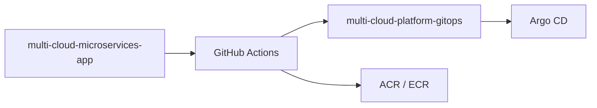

# Repository Relationship



## Description

The project follows a two-repository model.

Application concerns:

* source code
* Dockerfiles
* CI pipelines

Platform concerns:

* Terraform
* Helm charts
* Argo CD
* GitOps manifests

```
```
